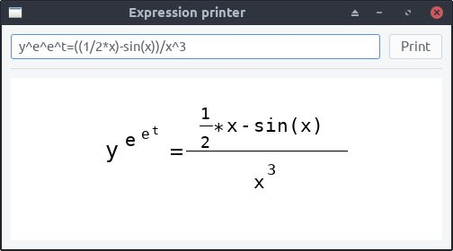
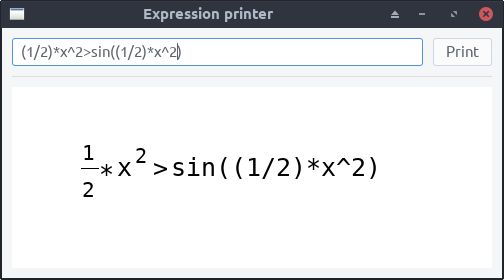

# Math expression printer

## What this does

The program expects a string of characters representing a mathematical expression and draws it in the window with:

- no redundant pairs of parentheses
- horizontal fraction bars
- exponents shifted up

Recognized operators are binary `+`, `-`, `*`, `/`, `^`, `=`, `<`, `>`. You can also use `(` and `)`. Any other character will be considered a part of an operand.

After entering the expression, press `Enter` button on the keyboard or `Print` button in the window, and the expression will be printed, or a pop-up window will appear if a parsing error occurs.

## Compiling

To compile the source on Linux:

1. Install `libgtk-3-dev` with its dependencies.
2. In the directory with the source files and the Makefile, run `make`.

## Extra info

Things like `sin(x)` will miraculously work, even though I did not anticipate the user to input such strings, but if you replace `x` with a more complex expression, it will **not** be parsed, therefore, in most cases it will not be nicely printed.

